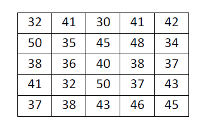
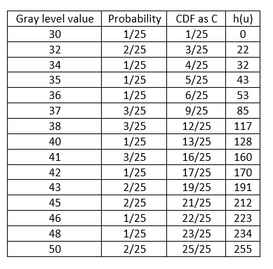

# Errata
This page lists all the errors and the corresponding correction to "Image Processing and Acquisition using Python" written by Ravi Chityala and Sridevi Pudipeddi. 

## List of errors and corrections:

* Page 12 - The statement 'print a[0]' prints 'scipy' but the correct output is 'numpy'.
* Page 38 - The bitdepth range for 16 bit is [-32768, 32767] and not [-32768, 327678].
* Page 102 - The probablities in figure 5.9 calculated from the image in figure 5.8 are incorrect. So we changed both the figure 5.8 and 5.9. The correct images are shown below. 

*Figure 5.8 An example of a 5-by-5 image.*

*Figure 5.9 Probabilities, CDF, histogram equalization transformation*

